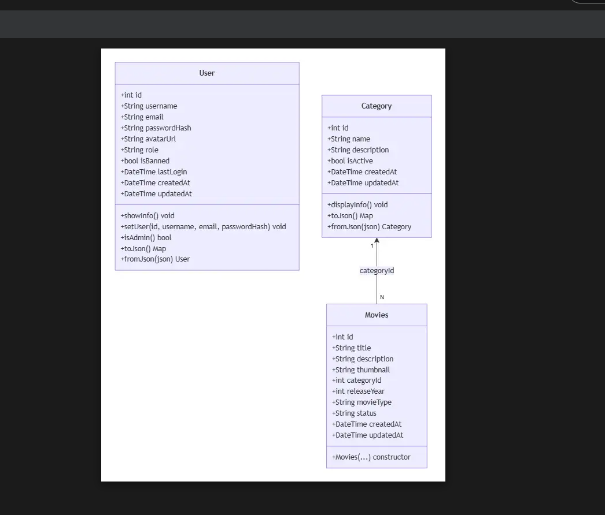

### 🎬 Quản lý Dữ liệu Phim (Movie Module)

#### 1. Thiết kế Mô hình Dữ liệu (Data Model)
Dựa trên lược đồ thực thể (Class Diagram), đối tượng `Movie` đã được mô hình hóa thành Dart class trong ứng dụng Flutter:
* **Vị trí file:** `lib/models/movie.dart`
* **Các trường dữ liệu chính:**
  * `id` (`int`): Mã định danh duy nhất của phim.
  * `title` (`String`): Tiêu đề/tên bộ phim.
  * `description` (`String`): Mô tả nội dung phim.
  * `thumbnail` (`String`): URL ảnh đại diện poster.
  * `categoryId` (`int`), `countryId` (`int`): Khóa ngoại liên kết danh mục và quốc gia.
  * `releaseYear` (`int`): Năm phát hành.
  * `movieType` (`String`), `status` (`String`): Phân loại (phim lẻ/bộ) và trạng thái hiển thị.
  * `createdAt`, `updatedAt` (`DateTime`): Dấu vết thời gian tạo và cập nhật.
* 
### 🏷️ Quản lý Danh mục (Category Module)

Dựa trên lược đồ thực thể (Class Diagram), thực thể `Category` được mô hình hóa thành Dart class trong ứng dụng Flutter:
* **Vị trí file:** `lib/models/category.dart`
* **Các trường dữ liệu chính:**
  * `id` (`int`): Mã định danh duy nhất của danh mục.
  * `name` (`String`): Tên danh mục/thể loại phim.
  * `description` (`String`): Mô tả chi tiết về danh mục.
  * `isActive` (`bool`): Trạng thái hoạt động, xác định danh mục có đang được sử dụng hoặc hiển thị trong hệ thống hay không.
  * `createdAt` (`DateTime`): Thời điểm tạo bản ghi danh mục.
  * `updatedAt` (`DateTime`): Thời điểm cập nhật bản ghi danh mục gần nhất.

---

#### 2. Quan hệ Dữ liệu (Data Relationships)
* **Category — Movie (`1 - N`):** Một danh mục có thể liên kết với nhiều bộ phim (One-to-Many). Mỗi bản ghi `Movie` sẽ tham chiếu đến `Category` thông qua khóa ngoại `categoryId`.
### 👤 Quản lý Người dùng (User Module)

#### 1. Thiết kế Mô hình Dữ liệu (Data Model)

Dựa trên lược đồ thực thể (Class Diagram), đối tượng `User` đã được mô hình hóa thành Dart class trong ứng dụng Flutter:

* **Vị trí file:** `lib/models/User.dart`
* **Các trường dữ liệu chính:**
  * `id` (`int`): Mã định danh duy nhất của người dùng.
  * `username` (`String`): Tên đăng nhập của tài khoản.
  * `email` (`String`): Địa chỉ email, dùng để đăng nhập/liên hệ.
  * `passwordHash` (`String`): Mật khẩu đã được mã hóa, không lưu mật khẩu gốc.
  * `avatarUrl` (`String`, nullable): URL ảnh đại diện người dùng.
  * `role` (`String`): Vai trò tài khoản — `"admin"` hoặc `"user"`.
  * `isBanned` (`bool`): Trạng thái bị khóa/cấm tài khoản.
  * `lastLogin` (`DateTime`, nullable): Thời điểm đăng nhập gần nhất.
  * `createdAt`, `updatedAt` (`DateTime`): Dấu vết thời gian tạo và cập nhật tài khoản.

#### 2. Quan hệ Dữ liệu (Data Relationships)

* **User — Favorites (1 - N):** Một người dùng có thể yêu thích nhiều bộ phim (One-to-Many), thông qua bảng trung gian `Favorites` (chứa `userId` và `movieId`).
* `User` không liên kết trực tiếp với `Movie` hoặc `Category`, mà liên kết gián tiếp qua các bảng trung gian: `Ratings`, `Comments`, `Favorites`, `WatchHistory`, `Watchlist` — mỗi bảng đều chứa khóa ngoại `userId` tham chiếu đến `User`.
